# Android 基础面试题

> 面向 Android 初中级到中高级基础面试复习。答案尽量按“是什么、为什么、怎么用、常见坑、追问点”组织。

## 一、Android 系统与应用基础

### 1. Android 应用的基本组成是什么？

Android 应用通常由以下部分组成：

- `Activity`：负责展示界面和处理用户交互。
- `Service`：负责后台任务或跨进程暴露服务能力。
- `BroadcastReceiver`：接收系统或应用广播。
- `ContentProvider`：对外提供结构化数据访问。
- `Application`：应用进程级别的全局入口。
- `Resources`：图片、布局、字符串、颜色、尺寸等资源。
- `AndroidManifest.xml`：声明组件、权限、主题、入口 Activity 等。
- Gradle 构建脚本：管理依赖、构建类型、签名、混淆、打包等。

面试重点：四大组件不是普通类，必须经过系统框架调度，生命周期由系统管理。

### 2. Android 应用启动大致经过哪些步骤？

冷启动大致流程：

1. 用户点击图标，Launcher 通过 Binder 请求系统启动 Activity。
2. `ActivityTaskManagerService` / `ActivityManagerService` 处理启动请求。
3. 如果应用进程不存在，Zygote fork 出新进程。
4. 应用进程创建主线程，初始化 `ActivityThread`。
5. 创建 `Application` 并调用 `Application.onCreate()`。
6. 创建目标 `Activity`，依次执行 `attach()`、`onCreate()`、`onStart()`、`onResume()`。
7. `setContentView()` 加载布局，经过 measure/layout/draw，显示首帧。

常见追问：冷启动慢通常慢在 `Application` 初始化、ContentProvider 自动初始化、主线程 I/O、首页布局复杂、首屏接口串行。

### 3. APK、AAB、DEX、ART 分别是什么？

- APK：Android 安装包，包含 dex、资源、so、manifest、签名等。
- AAB：Android App Bundle，发布格式，Google Play 可按设备生成更小 APK。
- DEX：Dalvik Executable，Android 字节码文件。
- ART：Android Runtime，负责加载和执行 dex，支持 AOT、JIT、Profile Guided Compilation。

一句话理解：Kotlin/Java 编译成 class，再转成 dex，最终由 ART 执行。

### 4. Android 中的进程和线程有什么特点？

每个应用默认运行在独立 Linux 进程中，有独立虚拟机实例。应用启动后会创建主线程，也叫 UI 线程。

特点：

- UI 操作必须在主线程。
- 耗时任务不能放主线程，否则会卡顿甚至 ANR。
- 一个应用可以配置多进程，但多进程会带来内存增加、数据同步、初始化重复等问题。
- 同一进程内多线程共享内存，需要注意线程安全。

### 5. Android 为什么不能在子线程更新 UI？

Android View 系统不是线程安全的。如果多个线程同时修改 View 层级、属性和绘制状态，会导致状态不一致。

所以 Android 约定 UI 只能由主线程访问。子线程更新 UI 常见方式：

```kotlin
runOnUiThread {
    textView.text = "done"
}
```

或：

```kotlin
lifecycleScope.launch(Dispatchers.Main) {
    textView.text = "done"
}
```

## 二、Activity 基础

### 6. Activity 生命周期有哪些？

常见生命周期：

- `onCreate()`：创建 Activity，初始化布局和数据。
- `onStart()`：Activity 对用户可见。
- `onResume()`：Activity 位于前台，可交互。
- `onPause()`：Activity 失去焦点，适合暂停动画、提交轻量数据。
- `onStop()`：Activity 不可见，适合释放较重资源。
- `onDestroy()`：Activity 销毁。
- `onRestart()`：从 stopped 状态重新回到前台前调用。

常见流程：

```text
打开页面：onCreate -> onStart -> onResume
跳到新页面：onPause -> onStop
返回旧页面：onRestart -> onStart -> onResume
按返回键退出：onPause -> onStop -> onDestroy
```

### 7. `onPause()` 和 `onStop()` 有什么区别？

`onPause()` 表示 Activity 失去焦点，但可能仍然部分可见，例如弹出半透明 Activity 或 Dialog 样式 Activity。

`onStop()` 表示 Activity 完全不可见。

实践建议：

- `onPause()` 做轻量操作，例如暂停动画、停止传感器、提交小状态。
- `onStop()` 做相对重一点的释放，例如停止视频播放、注销部分监听。
- 不要在 `onPause()` 做耗时 I/O，因为会影响下一个 Activity 的启动。

### 8. Activity 横竖屏切换时生命周期如何变化？

默认情况下，横竖屏切换属于配置变化，Activity 会销毁并重建：

```text
onPause -> onStop -> onDestroy -> onCreate -> onStart -> onResume
```

保存状态方式：

```kotlin
override fun onSaveInstanceState(outState: Bundle) {
    super.onSaveInstanceState(outState)
    outState.putString("keyword", keyword)
}
```

恢复：

```kotlin
override fun onCreate(savedInstanceState: Bundle?) {
    super.onCreate(savedInstanceState)
    val keyword = savedInstanceState?.getString("keyword")
}
```

也可以通过 `ViewModel` 保存与界面相关的数据，避免配置变化导致数据丢失。

### 9. `onSaveInstanceState()` 和 `onRestoreInstanceState()` 什么时候调用？

系统认为 Activity 可能被销毁并需要恢复时，会调用 `onSaveInstanceState()`。例如：

- 横竖屏切换。
- 进入后台后进程被系统杀死。
- 多窗口或配置变化。

用户主动按返回键退出，通常不需要保存实例状态。

`onRestoreInstanceState()` 在 `onStart()` 之后调用，也可以在 `onCreate(savedInstanceState)` 中恢复。

### 10. Activity 的四种启动模式是什么？

1. `standard`

默认模式。每次启动都会创建新实例。

2. `singleTop`

如果目标 Activity 已经在栈顶，则复用它并回调 `onNewIntent()`；否则创建新实例。

适合通知栏点击、搜索页重复打开等。

3. `singleTask`

一个任务栈中只保留一个实例。如果实例已存在，会清理它上方的 Activity，并回调 `onNewIntent()`。

适合主页、入口页。

4. `singleInstance` / `singleInstancePerTask`

Activity 独占任务栈或在任务级别单例，使用较少，适合特殊隔离场景。

### 11. `onNewIntent()` 什么时候调用？

当 Activity 被复用而不是重新创建时调用，例如：

- `singleTop` 且 Activity 在栈顶。
- `singleTask` 已有实例。
- Intent 使用了某些复用栈的 flag。

注意：`onNewIntent()` 中如果需要使用新 Intent，要调用：

```kotlin
override fun onNewIntent(intent: Intent?) {
    super.onNewIntent(intent)
    setIntent(intent)
}
```

否则后续 `getIntent()` 仍可能拿到旧 Intent。

### 12. `finish()` 后一定会立刻执行 `onDestroy()` 吗？

不一定。`finish()` 表示请求结束 Activity，生命周期回调由系统调度。通常会走：

```text
onPause -> onStop -> onDestroy
```

但如果系统资源、窗口动画、主线程阻塞等情况存在，时机可能延后。面试中不要把生命周期理解为同步函数调用。

## 三、Fragment 基础

### 13. Fragment 生命周期有哪些？

Fragment 既有自身生命周期，也有 View 生命周期。

常见顺序：

```text
onAttach
onCreate
onCreateView
onViewCreated
onStart
onResume
onPause
onStop
onDestroyView
onDestroy
onDetach
```

重点：`onDestroyView()` 只销毁 Fragment 的 View，不一定销毁 Fragment 实例。

### 14. Fragment 为什么容易内存泄漏？

常见原因是 Fragment 的 View 已经销毁，但还持有旧 ViewBinding、Adapter、View 引用。

错误写法：

```kotlin
private lateinit var binding: FragmentHomeBinding
```

如果在 `onDestroyView()` 不清理，可能泄漏 View。

推荐写法：

```kotlin
private var _binding: FragmentHomeBinding? = null
private val binding get() = _binding!!

override fun onCreateView(
    inflater: LayoutInflater,
    container: ViewGroup?,
    savedInstanceState: Bundle?
): View {
    _binding = FragmentHomeBinding.inflate(inflater, container, false)
    return binding.root
}

override fun onDestroyView() {
    _binding = null
    super.onDestroyView()
}
```

### 15. `commit()` 和 `commitAllowingStateLoss()` 有什么区别？

`commit()` 在 Activity 状态已保存后再提交事务，可能抛出：

```text
Can not perform this action after onSaveInstanceState
```

`commitAllowingStateLoss()` 允许状态丢失，不抛异常，但事务可能在进程恢复后丢失。

实践建议：

- 普通页面跳转优先用 `commit()`。
- 非关键 UI 状态、关闭弹窗等可考虑 `commitAllowingStateLoss()`。
- 不要滥用 `commitAllowingStateLoss()` 掩盖生命周期问题。

### 16. Fragment 如何与 Activity 通信？

常见方式：

- 共享 `ViewModel`。
- Fragment Result API。
- 接口回调。
- Navigation Component 参数传递。

推荐共享 ViewModel：

```kotlin
private val vm: SharedViewModel by activityViewModels()
```

这样比强转 Activity 调方法更解耦，也更适合配置变化。

## 四、Service 基础

### 17. Service 是不是运行在子线程？

不是。Service 默认运行在主线程。

这是一道高频题。Service 只是没有界面的组件，不代表它自动在后台线程。耗时任务仍然需要自己切线程：

```kotlin
override fun onStartCommand(intent: Intent?, flags: Int, startId: Int): Int {
    lifecycleScope.launch(Dispatchers.IO) {
        uploadLogs()
    }
    return START_NOT_STICKY
}
```

### 18. `startService()` 和 `bindService()` 有什么区别？

- `startService()`：启动式服务，适合执行一个后台任务。调用 `stopSelf()` 或 `stopService()` 停止。
- `bindService()`：绑定式服务，适合组件与服务交互。所有客户端解绑后服务可销毁。

一个 Service 可以同时被 start 和 bind。只有 start 停止且 bind 全部解绑后，服务才会真正销毁。

### 19. 前台服务是什么？

前台服务是用户可感知的长期任务，必须显示通知，例如：

- 音乐播放。
- 导航。
- 通话。
- 运动记录。

Android 8.0 之后，调用 `startForegroundService()` 后必须尽快调用 `startForeground()`，否则可能 ANR。

### 20. IntentService 为什么不推荐了？

`IntentService` 内部用单工作线程串行处理任务，处理完自动停止。但它已经不推荐使用，因为后台执行限制越来越严格。

现代替代方案：

- 可延迟后台任务：`WorkManager`。
- 前台用户可感知任务：Foreground Service。
- 简单异步任务：Coroutine + lifecycle-aware scope。

## 五、BroadcastReceiver 基础

### 21. BroadcastReceiver 有什么作用？

BroadcastReceiver 用于接收广播消息，包括：

- 系统广播：网络变化、电量变化、开机完成等。
- 应用内广播：模块间事件通知。

广播接收器的 `onReceive()` 运行在主线程，必须快速返回，不能做耗时任务。

### 22. 静态注册和动态注册有什么区别？

静态注册：

- 在 Manifest 中声明。
- 应用未启动时也可能被系统拉起。
- Android 8.0 之后很多隐式广播不再支持静态注册。

动态注册：

- 代码中通过 `registerReceiver()` 注册。
- 生命周期由注册者控制。
- 需要及时 `unregisterReceiver()`，否则可能泄漏。

### 23. BroadcastReceiver 中能做耗时操作吗？

不能直接做耗时操作。`onReceive()` 有执行时间限制，超时可能导致 ANR。

如果需要异步处理，可以使用：

```kotlin
override fun onReceive(context: Context, intent: Intent) {
    val pendingResult = goAsync()
    executor.execute {
        try {
            doWork()
        } finally {
            pendingResult.finish()
        }
    }
}
```

但更推荐把长期任务交给 WorkManager。

### 24. LocalBroadcastManager 为什么不推荐了？

`LocalBroadcastManager` 已废弃。它本质是应用内事件总线，容易造成隐式依赖和难以追踪的数据流。

替代方案：

- `LiveData` / `StateFlow` / `SharedFlow`。
- 明确接口回调。
- Repository + ViewModel 共享状态。

## 六、ContentProvider 基础

### 25. ContentProvider 有什么作用？

ContentProvider 用于跨应用或跨进程共享结构化数据，例如通讯录、媒体库。

常见方法：

- `query()`
- `insert()`
- `delete()`
- `update()`
- `getType()`

访问通过 `ContentResolver`：

```kotlin
contentResolver.query(uri, projection, selection, selectionArgs, sortOrder)
```

### 26. ContentProvider 为什么会影响启动？

应用进程启动时，系统会先初始化 Manifest 中声明的 ContentProvider，然后才调用 `Application.onCreate()`。

很多 SDK 使用 ContentProvider 做自动初始化。如果 Provider 里做了重活，会直接拖慢启动。

优化方式：

- 移除不必要 Provider。
- AndroidX Startup 中关闭非必要 initializer。
- Provider 中只做轻量初始化。
- 多进程下避免重复初始化。

## 七、Intent 与 PendingIntent

### 27. 显式 Intent 和隐式 Intent 有什么区别？

显式 Intent 指定具体组件：

```kotlin
Intent(this, DetailActivity::class.java)
```

隐式 Intent 不指定组件，通过 action、category、data 匹配：

```kotlin
Intent(Intent.ACTION_VIEW, Uri.parse("https://example.com"))
```

显式 Intent 常用于应用内部跳转；隐式 Intent 常用于打开浏览器、相机、分享等跨应用场景。

### 28. Intent 传大对象有什么问题？

Intent 数据通过 Binder 传递，有大小限制。传太大对象可能触发：

```text
TransactionTooLargeException
```

实践建议：

- Intent 只传 id、type、少量参数。
- 大数据放数据库、缓存、文件或 ViewModel/Repository。
- Bitmap 不要直接塞 Intent。

### 29. PendingIntent 是什么？

`PendingIntent` 是把一个未来要执行的 Intent 授权给其他应用或系统执行。

常见场景：

- 通知点击。
- AlarmManager。
- AppWidget。

Android 12 之后必须明确可变性：

```kotlin
PendingIntent.FLAG_IMMUTABLE
```

或：

```kotlin
PendingIntent.FLAG_MUTABLE
```

能用 immutable 就尽量用 immutable，安全性更好。

## 八、Context 基础

### 30. Activity Context 和 Application Context 有什么区别？

Activity Context 绑定 Activity 生命周期，包含主题、窗口、页面资源信息。

Application Context 绑定应用进程生命周期，不依赖具体页面。

适用场景：

- 创建 Dialog、启动需要页面结果的 Activity：使用 Activity Context。
- 单例、数据库、图片库、全局初始化：使用 Application Context。

常见坑：单例持有 Activity Context 会导致 Activity 泄漏。

### 31. 为什么 Dialog 不能用 Application Context？

Dialog 需要依附窗口 token，而 Application Context 没有 Activity 窗口。

错误：

```kotlin
AlertDialog.Builder(applicationContext).show()
```

可能报：

```text
Unable to add window -- token null is not valid
```

Dialog 应使用 Activity Context，并在 Activity finishing/destroyed 时避免展示。

### 32. `getContext()`、`requireContext()`、`activity` 有什么区别？

在 Fragment 中：

- `context` / `getContext()`：可能为 null。
- `requireContext()`：非空，如果未 attach 会抛异常。
- `activity`：可能为 null。
- `requireActivity()`：非空，如果未 attach 会抛异常。

异步回调中使用 `requireContext()` 要谨慎，Fragment 可能已经 detached。

## 九、Handler、Looper、MessageQueue

### 33. Handler 机制是什么？

Android 主线程消息机制由三部分组成：

- `Looper`：不断从队列取消息。
- `MessageQueue`：保存消息。
- `Handler`：发送和处理消息。

主线程启动时会准备 Looper：

```text
Looper.prepareMainLooper()
Looper.loop()
```

开发者通过 Handler 往 MessageQueue 投递消息，Looper 取出后回调 Handler 处理。

### 34. Handler 为什么可能导致内存泄漏？

如果内部类 Handler 或 Runnable 持有 Activity，且消息延迟执行，Activity 退出后仍被 MessageQueue 间接持有。

错误写法：

```kotlin
handler.postDelayed({
    textView.text = "done"
}, 10_000)
```

修复：

```kotlin
override fun onDestroy() {
    handler.removeCallbacksAndMessages(null)
    super.onDestroy()
}
```

现代项目可优先使用 lifecycle-aware coroutine：

```kotlin
lifecycleScope.launch {
    delay(10_000)
    textView.text = "done"
}
```

### 35. `post()` 和 `sendMessage()` 有什么区别？

`post(Runnable)` 本质也是把 Runnable 包装成 Message 放入 MessageQueue。

区别：

- `post` 更适合直接执行一段代码。
- `sendMessage` 更适合通过 `what`、`arg1`、`obj` 区分多种消息。

### 36. IdleHandler 是什么？

`MessageQueue.IdleHandler` 会在消息队列空闲时执行。

常用于启动优化，把非首屏关键任务放到主线程空闲时执行：

```kotlin
Looper.myQueue().addIdleHandler {
    initNonCriticalSdk()
    false
}
```

返回 `false` 表示只执行一次，返回 `true` 表示继续保留。

## 十、线程、协程与异步

### 37. Android 常见异步方式有哪些？

- `Thread`
- `HandlerThread`
- `ExecutorService`
- Kotlin Coroutine
- RxJava
- WorkManager

现代 Android 推荐：

- 生命周期内异步任务：Coroutine + `lifecycleScope` / `viewModelScope`。
- 后台可延迟任务：WorkManager。
- 单独串行消息线程：HandlerThread。

### 38. `lifecycleScope` 和 `viewModelScope` 有什么区别？

- `lifecycleScope` 绑定 `LifecycleOwner`，Activity/Fragment 销毁时取消。
- `viewModelScope` 绑定 ViewModel，ViewModel `onCleared()` 时取消。

页面旋转时 Activity 重建，`lifecycleScope` 会取消，`viewModelScope` 通常继续存在。

### 39. `Dispatchers.Main`、`IO`、`Default` 怎么选？

- `Dispatchers.Main`：UI 更新。
- `Dispatchers.IO`：网络、数据库、文件读写。
- `Dispatchers.Default`：CPU 密集任务，如排序、JSON 大量解析、图片处理。

示例：

```kotlin
viewModelScope.launch {
    val user = withContext(Dispatchers.IO) {
        repository.fetchUser()
    }
    _uiState.value = UiState.Success(user)
}
```

### 40. WorkManager 适合什么场景？

WorkManager 适合可延迟、需要保证最终执行的后台任务。

例如：

- 日志上传。
- 数据同步。
- 图片压缩上传。
- 失败重试任务。

不适合：

- 立即执行的前台交互。
- 精确闹钟。
- 长时间实时任务，如音乐播放。

## 十一、View 绘制与事件

### 41. View 绘制流程是什么？

View 绘制三大流程：

1. `measure`：测量宽高。
2. `layout`：确定位置。
3. `draw`：绘制内容。

对应方法：

```kotlin
onMeasure()
onLayout()
onDraw()
```

常见追问：`requestLayout()` 会触发重新测量和布局，`invalidate()` 只请求重绘。

### 42. `match_parent`、`wrap_content` 在测量中如何理解？

父 View 会根据自身 `MeasureSpec` 和子 View 的 LayoutParams 生成子 View 的 `MeasureSpec`。

`MeasureSpec` 有三种模式：

- `EXACTLY`：确定大小，例如具体 dp、match_parent。
- `AT_MOST`：最大不超过某个值，常见于 wrap_content。
- `UNSPECIFIED`：父容器不限制大小，少见，常见于 ScrollView 内部某些测量。

### 43. `invalidate()` 和 `requestLayout()` 有什么区别？

- `invalidate()`：请求重绘，最终调用 `draw()` / `onDraw()`。
- `requestLayout()`：请求重新测量和布局，可能触发 measure、layout、draw。

如果只是颜色、文本绘制内容变化，用 `invalidate()`。

如果宽高、位置、布局参数变化，用 `requestLayout()`。

### 44. Android 事件分发流程是什么？

核心方法：

- `dispatchTouchEvent()`：分发事件。
- `onInterceptTouchEvent()`：ViewGroup 是否拦截。
- `onTouchEvent()`：处理事件。

Activity 到 ViewGroup 到 View：

```text
Activity.dispatchTouchEvent
 -> ViewGroup.dispatchTouchEvent
 -> ViewGroup.onInterceptTouchEvent
 -> Child.dispatchTouchEvent
 -> Child.onTouchEvent
```

如果子 View 不消费事件，事件会向父级回传。

### 45. `onTouch`、`onTouchEvent`、`onClick` 的执行关系？

大致顺序：

```text
dispatchTouchEvent
 -> OnTouchListener.onTouch
 -> onTouchEvent
 -> OnClickListener.onClick
```

如果 `onTouch()` 返回 `true`，表示事件被消费，`onTouchEvent()` 和 `onClick()` 通常不会再执行。

### 46. RecyclerView 和 ListView 有什么区别？

RecyclerView 更灵活：

- 强制使用 ViewHolder。
- 支持 LayoutManager，可实现线性、网格、瀑布流。
- 支持 ItemDecoration。
- 支持 ItemAnimator。
- 复用机制更灵活。
- 可结合 DiffUtil/ListAdapter 做高效刷新。

ListView 更老，扩展性和动画能力较弱。

### 47. RecyclerView 局部刷新怎么做？

使用 DiffUtil 或 payload。

```kotlin
override fun getChangePayload(oldItem: Item, newItem: Item): Any? {
    return if (oldItem.likeCount != newItem.likeCount) {
        "like"
    } else {
        null
    }
}
```

在 Adapter 中：

```kotlin
override fun onBindViewHolder(holder: VH, position: Int, payloads: MutableList<Any>) {
    if (payloads.contains("like")) {
        holder.updateLike(getItem(position).likeCount)
    } else {
        super.onBindViewHolder(holder, position, payloads)
    }
}
```

## 十二、数据存储

### 48. Android 常见数据存储方式有哪些？

- SharedPreferences：小型键值对。
- DataStore：现代键值/Proto 数据存储，替代部分 SharedPreferences。
- SQLite/Room：结构化关系型数据。
- File：普通文件。
- MMKV：高性能键值存储，第三方方案。
- MediaStore：媒体文件访问。

### 49. SharedPreferences 有什么特点和坑？

适合小型配置，不适合大 JSON、大列表和频繁写入。

常见坑：

- 首次读取可能触发磁盘 I/O。
- `commit()` 同步写入，可能阻塞线程。
- `apply()` 异步写入，但仍要注意大量频繁写入。
- 多进程支持不好。

### 50. Room 有什么优势？

Room 是 SQLite 的抽象层，优势：

- 编译期校验 SQL。
- 支持 DAO。
- 支持 LiveData/Flow。
- 支持 Migration。
- 与协程集成好。

示例：

```kotlin
@Dao
interface UserDao {
    @Query("SELECT * FROM user WHERE id = :id")
    suspend fun getUser(id: Long): UserEntity?
}
```

### 51. 数据库升级要注意什么？

必须提供 Migration，否则用户升级后可能崩溃或丢数据。

```kotlin
val MIGRATION_1_2 = object : Migration(1, 2) {
    override fun migrate(db: SupportSQLiteDatabase) {
        db.execSQL("ALTER TABLE user ADD COLUMN age INTEGER NOT NULL DEFAULT 0")
    }
}
```

不要轻易使用 `fallbackToDestructiveMigration()`，它会删除旧数据重建数据库。

## 十三、网络与序列化

### 52. HTTP 和 HTTPS 有什么区别？

HTTPS = HTTP + TLS。

HTTPS 提供：

- 加密传输。
- 身份认证。
- 数据完整性校验。

Android 9 开始默认禁止明文 HTTP，除非通过 Network Security Config 显式允许。

### 53. Retrofit 的基本原理是什么？

Retrofit 通过动态代理创建接口实现，把接口方法注解解析成 HTTP 请求，再交给 OkHttp 执行，最后通过 Converter 把响应转换成对象。

示例：

```kotlin
interface Api {
    @GET("user/{id}")
    suspend fun getUser(@Path("id") id: Long): User
}
```

### 54. OkHttp 拦截器有哪些类型？

- Application Interceptor：应用层拦截器，只调用一次，适合加公共参数、日志、token。
- Network Interceptor：网络层拦截器，可观察重定向、重试后的实际网络请求。

常见用途：

- 添加 Header。
- token 刷新。
- 日志打印。
- 缓存控制。
- 请求签名。

### 55. 网络请求如何避免内存泄漏？

- 页面销毁时取消请求。
- 使用 `viewModelScope` 发起请求。
- 回调中不要强持有 Activity。
- 图片请求绑定生命周期。
- 避免单例保存 View 或 Activity。

协程示例：

```kotlin
class UserViewModel : ViewModel() {
    fun loadUser() {
        viewModelScope.launch {
            repository.getUser()
        }
    }
}
```

## 十四、图片与资源

### 56. `drawable`、`mipmap`、`assets`、`raw` 有什么区别？

- `drawable`：普通图片、shape、selector、vector 等。
- `mipmap`：通常放 launcher icon，系统会根据密度选择。
- `assets`：原样打包，使用 `assets.open()` 读取。
- `raw`：原样资源，有资源 id，可通过 `R.raw.xxx` 访问。

### 57. Bitmap 为什么容易 OOM？

图片文件大小不等于内存大小。Bitmap 解码后内存通常按像素计算：

```text
宽 * 高 * 每像素字节数
```

例如 4000x3000 的 ARGB_8888 图片：

```text
4000 * 3000 * 4 ≈ 45.8MB
```

优化：

- 按目标尺寸加载。
- 使用图片库 resize。
- 控制缓存大小。
- 列表加载缩略图。
- 避免一次持有多张大图。

### 58. VectorDrawable 有什么优缺点？

优点：

- 体积小。
- 不同分辨率清晰。
- 适合简单图标。

缺点：

- 复杂 vector 绘制成本高。
- 不适合复杂图片、照片。
- 某些复杂路径在低端机上可能影响性能。

## 十五、权限与安全

### 59. Android 运行时权限是什么？

Android 6.0 开始，危险权限需要运行时申请，例如相机、定位、麦克风、联系人。

流程：

```kotlin
requestPermissions(arrayOf(Manifest.permission.CAMERA), 100)
```

现代项目推荐使用 Activity Result API：

```kotlin
val launcher = registerForActivityResult(
    ActivityResultContracts.RequestPermission()
) { granted ->
    if (granted) openCamera()
}
```

### 60. Android 13/14 常见权限变化有哪些？

常见变化：

- Android 13 引入通知权限 `POST_NOTIFICATIONS`。
- Android 13 细分媒体权限，如图片、视频、音频。
- Android 14 对前台服务类型、后台启动、隐式 Intent 等限制更严格。

面试回答重点：权限越来越细，申请时要按场景最小化申请，并做好拒绝后的降级体验。

### 61. `FLAG_SECURE` 有什么作用？

`FLAG_SECURE` 用于防止窗口内容被截图、录屏或显示在不安全的外部显示设备上。

```kotlin
window.addFlags(WindowManager.LayoutParams.FLAG_SECURE)
```

常用于：

- 支付页面。
- 隐私页面。
- 视频通话。
- DRM 内容。

它一般不负责布局，也不会直接改变导航栏高度。

## 十六、Jetpack 基础

### 62. ViewModel 的作用是什么？

ViewModel 用于保存与 UI 相关的数据，并在配置变化时保留。

特点：

- Activity/Fragment 重建时 ViewModel 不会立即销毁。
- 不应持有 Activity/View Context。
- 适合放页面状态和业务请求。

```kotlin
class HomeViewModel : ViewModel() {
    val uiState = MutableStateFlow(HomeUiState())
}
```

### 63. LiveData 和 StateFlow 有什么区别？

LiveData：

- 生命周期感知。
- 主线程更新更常见。
- 与 XML DataBinding 结合方便。

StateFlow：

- Kotlin Flow 体系。
- 必须有初始值。
- 更适合协程和单向数据流。

现代 Kotlin 项目常用 `StateFlow` 表示 UI state，`SharedFlow` 表示一次性事件。

### 64. ViewBinding 和 DataBinding 有什么区别？

ViewBinding：

- 生成绑定类，替代 `findViewById`。
- 类型安全。
- 不支持表达式绑定。

DataBinding：

- 支持 XML 表达式。
- 支持双向绑定。
- 编译和调试成本更高。

如果只是拿 View，优先 ViewBinding；需要 XML 表达式或双向绑定时用 DataBinding。

### 65. Navigation Component 解决什么问题？

Navigation Component 用于管理 Fragment 跳转、返回栈、参数传递和深链。

优势：

- 导航图可视化。
- Safe Args 类型安全传参。
- 统一返回栈管理。
- 支持 deep link。

大型项目也可能使用 ARouter、自研路由或 Compose Navigation。

## 十七、构建、签名与混淆

### 66. debug 包和 release 包有什么区别？

debug 包：

- 默认可调试。
- 使用 debug 签名。
- 通常不开启混淆和资源压缩。

release 包：

- 使用正式签名。
- 通常开启 R8 混淆、压缩、优化。
- 不应输出敏感日志。

### 67. R8/混淆有什么作用？

R8 主要作用：

- 删除无用代码。
- 优化字节码。
- 混淆类名、方法名、字段名。
- 减小包体。

常见需要 keep：

- 反射调用的类。
- Gson/Jackson 序列化字段。
- JNI 调用类。
- 第三方 SDK 要求的入口。

错误示例：

```proguard
-keep class com.example.** { *; }
```

这会让大量代码无法被压缩优化。

### 68. v1、v2、v3、v4 签名有什么区别？

- v1：基于 Jar 签名，兼容老系统。
- v2：Android 7.0 引入，对整个 APK 签名，安装校验更快。
- v3：Android 9 引入，支持密钥轮换。
- v4：用于增量安装等场景。

实际项目通常由 Android Gradle Plugin 自动处理。

## 十八、ANR、Crash、内存基础

### 69. ANR 是什么？

ANR 是 Application Not Responding，表示应用长时间无响应。

常见原因：

- 主线程耗时操作。
- 主线程等待锁。
- Binder 调用阻塞。
- BroadcastReceiver 执行超时。
- Service 前台启动超时。
- CPU 被打满。

解决思路：分析 ANR traces，看 main 线程状态和持锁线程。

### 70. Crash 和 Exception 有什么区别？

Exception 是异常对象。未捕获异常导致进程终止，才表现为 Crash。

常见 Crash：

- `NullPointerException`
- `IndexOutOfBoundsException`
- `IllegalStateException`
- `ClassCastException`
- `Resources.NotFoundException`

治理方式：

- 崩溃采集。
- Top crash 优先修复。
- 灰度发布。
- 增加边界判断和状态校验。

### 71. 内存泄漏是什么？

对象已经不再需要，但仍被 GC Root 间接引用，导致无法回收，就是内存泄漏。

常见泄漏：

- 单例持有 Activity。
- Handler 延迟消息持有 View。
- 监听器未注销。
- Fragment ViewBinding 未清理。
- WebView 未销毁。
- 协程/Rx 任务超过生命周期。

### 72. OOM 和内存泄漏是什么关系？

内存泄漏可能导致 OOM，但 OOM 不一定都是泄漏。

OOM 可能来自：

- 大图解码。
- 一次加载大量数据。
- 缓存过大。
- Native 内存增长。
- WebView 占用高。
- 多进程内存高。

排查时要区分“持续不释放”和“瞬时峰值过高”。

## 十九、常见场景题

### 73. 点击按钮跳转页面，完整过程你怎么理解？

1. View 接收点击事件。
2. `OnClickListener` 执行。
3. 创建 Intent。
4. 调用 `startActivity()`。
5. 请求通过 Binder 到系统服务。
6. 系统检查目标 Activity、权限、启动模式、任务栈。
7. 应用进程内创建或复用 Activity。
8. 执行生命周期并绘制界面。

面试时可按“事件分发 -> Intent -> AMS/ATMS -> 生命周期 -> 绘制”回答。

### 74. 如何设计一个页面的数据加载？

推荐结构：

```text
Activity/Fragment
 -> ViewModel
 -> Repository
 -> RemoteDataSource / LocalDataSource
 -> API / Room
```

View 只负责渲染和用户事件，ViewModel 管理 UI 状态，Repository 负责数据来源协调。

### 75. 页面旋转后网络请求会怎样？

如果请求直接放在 Activity 中，旋转后 Activity 重建，可能导致：

- 请求重复。
- 回调引用旧 Activity。
- 数据丢失。

更好的方式是把请求放到 ViewModel：

```kotlin
class DetailViewModel : ViewModel() {
    val state = MutableStateFlow<UiState>(UiState.Loading)
}
```

旋转后新 Activity 重新观察同一个 ViewModel 状态。

### 76. 如何避免重复点击？

常见方式：

- 按钮短时间禁用。
- debounce。
- throttle。
- 请求中状态拦截。

示例：

```kotlin
button.isEnabled = false
viewModelScope.launch {
    try {
        submit()
    } finally {
        button.isEnabled = true
    }
}
```

注意：只做 UI 层防抖不够，关键操作服务端也要幂等。

### 77. 如何判断一个 Android 基础回答是否高级？

普通回答只讲概念；更好的回答会补充：

- 生命周期边界。
- 线程要求。
- 内存泄漏风险。
- 系统版本差异。
- 真实项目中的坑。
- 如何验证和排查。

例如问 Service，不能只说“后台服务”，还要说“默认运行在主线程，Android 8 后台限制，长期任务要前台服务或 WorkManager”。

## 二十、速记表

| 知识点 | 关键结论 |
| --- | --- |
| Activity | 负责界面，生命周期由系统管理 |
| Fragment | 注意 View 生命周期，`onDestroyView` 清理 View 引用 |
| Service | 默认运行在主线程 |
| BroadcastReceiver | `onReceive` 必须快速返回 |
| ContentProvider | 会早于 `Application.onCreate` 初始化 |
| Intent | 大数据不要直接传，避免 Binder 限制 |
| Context | Dialog 用 Activity Context，单例用 Application Context |
| Handler | Looper 取消息，Handler 发送和处理 |
| View 绘制 | measure、layout、draw |
| 事件分发 | dispatch、intercept、onTouchEvent |
| ViewModel | 保存 UI 状态，不持有 View/Activity |
| WorkManager | 可延迟且要保证执行的后台任务 |
| SharedPreferences | 适合小配置，不适合大数据 |
| Room | SQLite 抽象，支持编译期 SQL 校验 |
| R8 | 压缩、优化、混淆 |
| ANR | 主线程长时间无响应 |
| OOM | 可能是泄漏，也可能是瞬时峰值 |

## 二十一、流程图与深度理解

这一章用于把前面的知识串起来。面试中如果能画出这些流程，回答会比单纯背概念更清晰。

### 78. Android 冷启动完整流程图

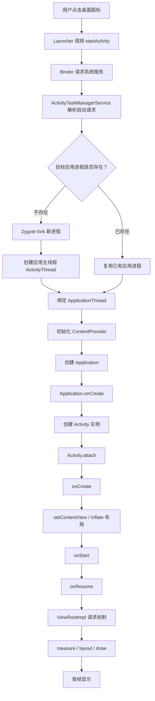

**细节解释**

冷启动不是从 `Activity.onCreate()` 才开始的。在它之前已经发生了很多事情，例如系统服务调度、进程创建、`ActivityThread` 初始化、`ContentProvider` 初始化、`Application.onCreate()`。

所以启动优化不能只盯着首页 Activity。常见启动耗时点包括：

- `ContentProvider` 自动初始化 SDK。
- `Application.onCreate()` 同步初始化过多 SDK。
- 主线程读取 SharedPreferences、数据库、文件。
- 首页布局 inflate 慢。
- 首页首屏接口串行等待。
- 首次类加载、反射、依赖注入成本高。

**面试表达**

可以这样回答：

```text
冷启动链路从 Launcher 发起 startActivity 开始，经过系统服务，如果进程不存在会由 Zygote fork 新进程。
应用进程起来后先初始化 ActivityThread、ContentProvider、Application，再创建目标 Activity。
Activity setContentView 后还要经过 ViewRootImpl 的 measure/layout/draw，首帧真正绘制出来才算用户看到界面。
所以启动优化要分阶段看，不能只看 Activity.onCreate。
```

### 79. Activity 生命周期流程图

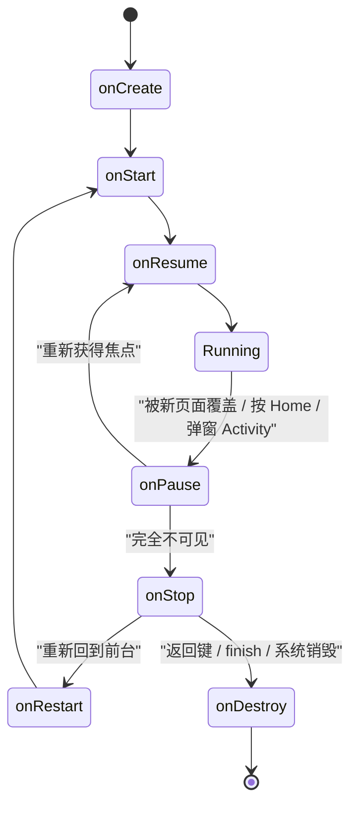

**几个容易混淆的点**

`onPause()` 不代表页面完全不可见，只代表失去焦点。比如一个半透明 Activity 覆盖上来，旧 Activity 可能只走到 `onPause()`，不一定走 `onStop()`。

`onStop()` 表示完全不可见，适合释放较重资源。比如视频播放、传感器、定位监听等可以在这里停止。

`onDestroy()` 不一定每次都可靠执行。进程被系统杀死时，未必有机会走完整生命周期。因此重要状态不能只依赖 `onDestroy()` 保存。

**场景速记**

| 场景 | 生命周期 |
| --- | --- |
| 打开 Activity | `onCreate -> onStart -> onResume` |
| 按 Home | `onPause -> onStop` |
| Home 后再回来 | `onRestart -> onStart -> onResume` |
| 打开新 Activity | 旧页面 `onPause`，新页面绘制后旧页面通常 `onStop` |
| 按返回键 | `onPause -> onStop -> onDestroy` |
| 横竖屏切换 | 旧页面销毁，新页面重建 |

### 80. Fragment 生命周期和 View 生命周期流程图

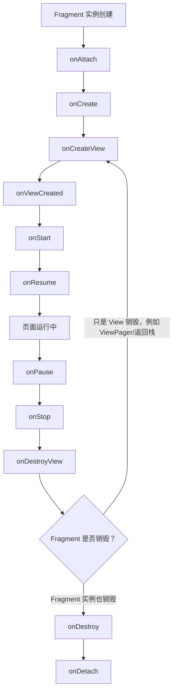

**为什么 Fragment 更容易泄漏**

Fragment 有两个生命周期：

- Fragment 实例生命周期。
- Fragment View 生命周期。

当 Fragment 进入返回栈时，`onDestroyView()` 可能已经执行，View 被销毁，但 Fragment 实例还在。如果此时 Fragment 字段继续持有 `binding`、`RecyclerView`、`Adapter`，就可能泄漏整个 View 树。

**推荐写法**

```kotlin
private var _binding: FragmentHomeBinding? = null
private val binding get() = _binding!!

override fun onCreateView(
    inflater: LayoutInflater,
    container: ViewGroup?,
    savedInstanceState: Bundle?
): View {
    _binding = FragmentHomeBinding.inflate(inflater, container, false)
    return binding.root
}

override fun onDestroyView() {
    binding.recyclerView.adapter = null
    _binding = null
    super.onDestroyView()
}
```

**面试追问**

如果面试官问“为什么 Activity 里 ViewBinding 不一定要置空，而 Fragment 里要置空”，可以回答：

```text
Activity 的生命周期和它的 View 生命周期基本一致，Activity 销毁时 View 也销毁。
Fragment 不一样，Fragment 实例可能还在返回栈里，但它的 View 已经在 onDestroyView 销毁。
所以 Fragment 持有 ViewBinding 字段时，必须在 onDestroyView 置空。
```

### 81. startActivity 跨进程调用流程图

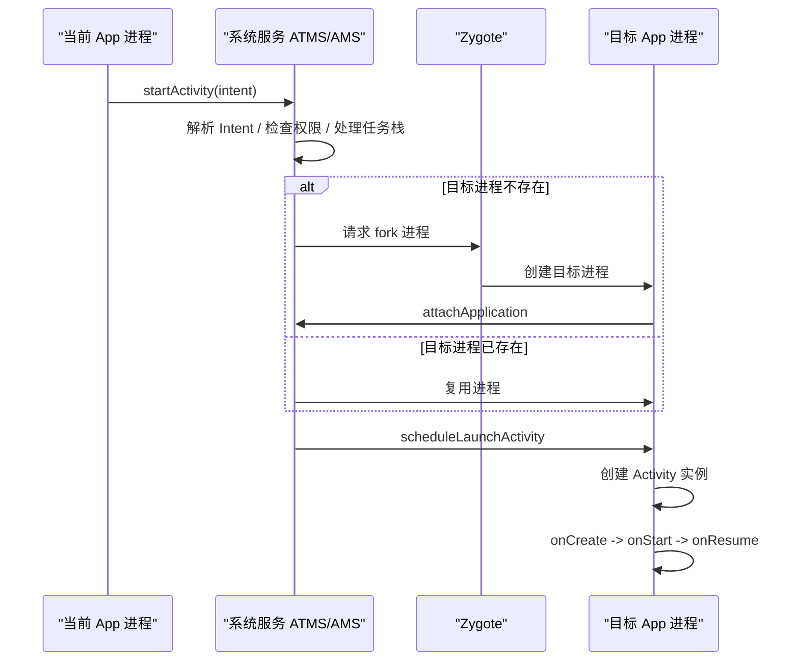

**重点理解**

`startActivity()` 看起来是一个普通方法，但它背后涉及 Binder 跨进程通信。当前应用不会直接 new 目标 Activity，而是把启动请求交给系统服务。系统服务决定任务栈、启动模式、权限和目标进程。

**为什么 Intent 数据不能太大**

Intent 通过 Binder 传递，Binder transaction 有大小限制。传大 Bitmap、大列表、大 JSON 可能导致：

```text
TransactionTooLargeException
```

实践中 Intent 应只传轻量参数：

```kotlin
Intent(this, DetailActivity::class.java).apply {
    putExtra("user_id", userId)
}
```

大数据放数据库、缓存、文件或 Repository。

### 82. Handler 消息机制流程图

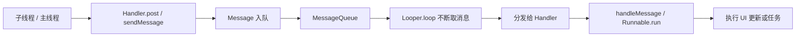

**主线程为什么不会退出**

主线程执行 `Looper.loop()` 后，会一直从 `MessageQueue` 中取消息。没有消息时并不是疯狂循环，而是通过 native 层 epoll 等机制进入等待状态，有消息再被唤醒。

**Handler 内存泄漏流程**

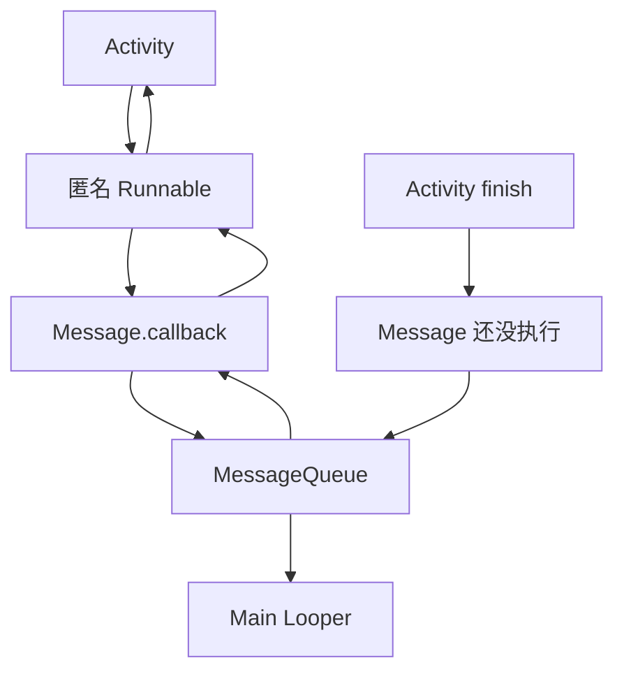

如果延迟消息还在队列中，Runnable 又捕获了 Activity，Activity 就不能被回收。

**解决方式**

```kotlin
private val handler = Handler(Looper.getMainLooper())

override fun onDestroy() {
    handler.removeCallbacksAndMessages(null)
    super.onDestroy()
}
```

更现代的写法：

```kotlin
lifecycleScope.launch {
    delay(3000)
    if (lifecycle.currentState.isAtLeast(Lifecycle.State.STARTED)) {
        render()
    }
}
```

### 83. View 绘制流程图

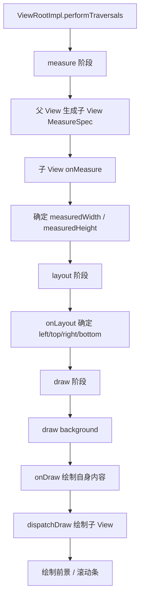

**`requestLayout()` 和 `invalidate()` 的区别图**

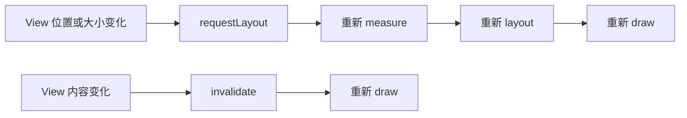

**示例**

只改文字颜色：

```kotlin
textView.setTextColor(Color.RED)
```

一般触发重绘即可。

改宽高：

```kotlin
view.layoutParams.width = 200
view.requestLayout()
```

需要重新测量布局。

**自定义 View 常见坑**

- 在 `onDraw()` 中创建对象，会导致频繁 GC。
- `onMeasure()` 没处理 `wrap_content`，自定义 View 可能占满父布局。
- 频繁 `requestLayout()` 会导致布局抖动。
- 大图直接绘制，可能导致内存和渲染压力。

### 84. 事件分发流程图

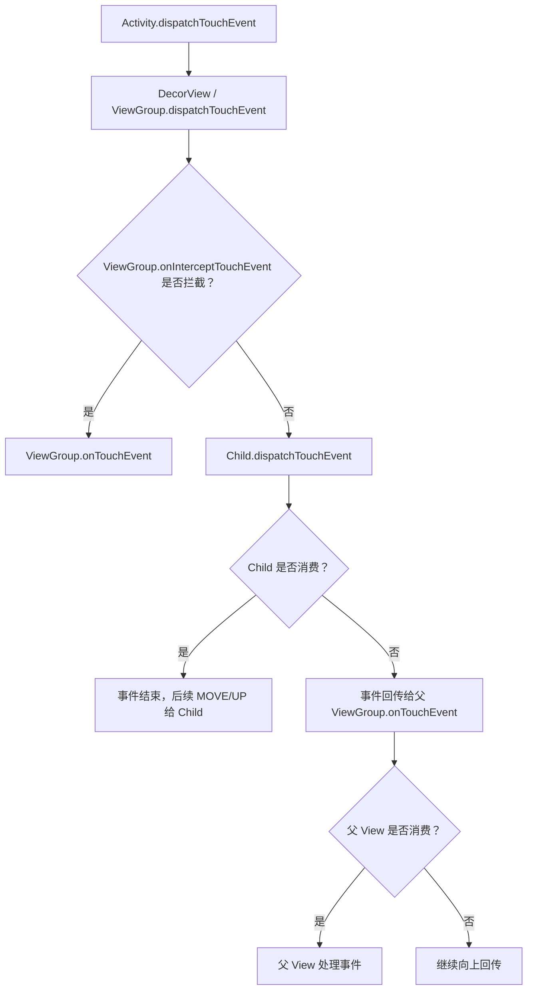

**ACTION_DOWN 的特殊性**

一次完整事件序列通常是：

```text
ACTION_DOWN -> ACTION_MOVE -> ACTION_MOVE -> ACTION_UP
```

如果某个 View 没有消费 `ACTION_DOWN`，它通常就不会再收到后续 MOVE/UP。因为系统认为它不是这次手势的目标。

**`onTouch` 和 `onClick` 的关系**

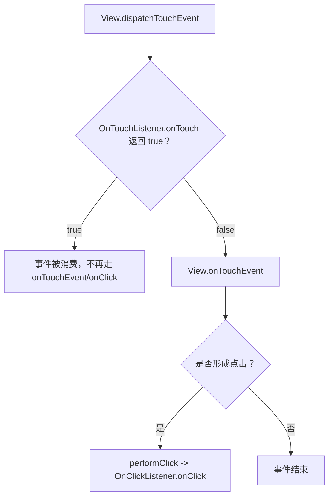

**面试表达**

```text
事件先到 Activity，再到 DecorView，再到 ViewGroup。
ViewGroup 可以通过 onInterceptTouchEvent 决定是否拦截。
如果不拦截就继续分发给子 View。
子 View 消费 ACTION_DOWN 后，后续 MOVE/UP 一般继续给它。
如果子 View 不消费，事件会回传给父 View。
```

### 85. Service 启动与绑定流程图

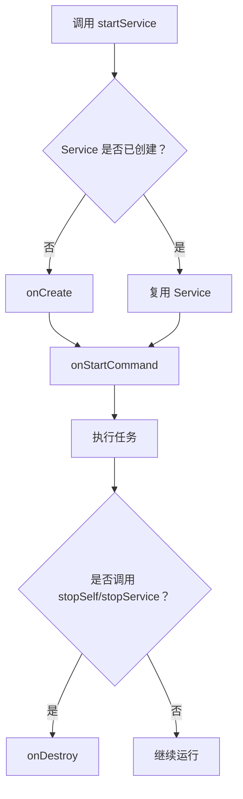

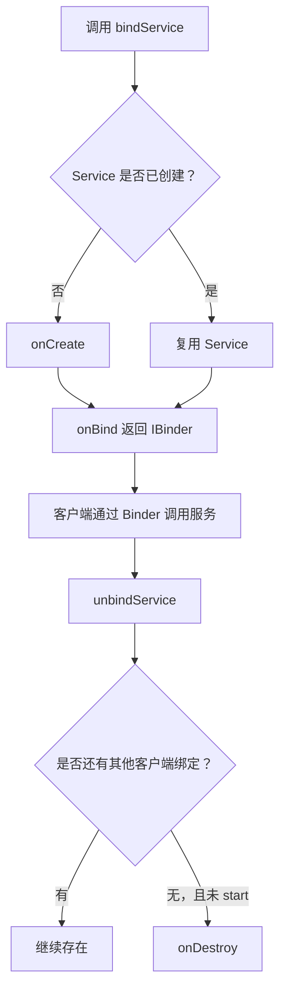

**重要细节**

Service 默认运行在主线程。下面这种写法仍然会卡主线程：

```kotlin
override fun onStartCommand(intent: Intent?, flags: Int, startId: Int): Int {
    uploadBigFile()
    return START_NOT_STICKY
}
```

应该切线程：

```kotlin
override fun onStartCommand(intent: Intent?, flags: Int, startId: Int): Int {
    serviceScope.launch(Dispatchers.IO) {
        uploadBigFile()
        stopSelf(startId)
    }
    return START_NOT_STICKY
}
```

### 86. BroadcastReceiver 执行流程图

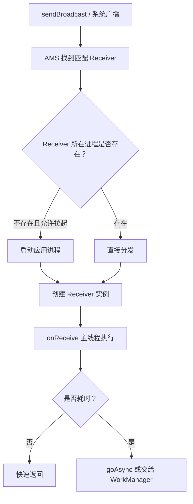

**为什么 `onReceive()` 不能做耗时任务**

`onReceive()` 在主线程执行，并且广播有超时限制。耗时操作会阻塞主线程，严重时导致 ANR。

如果确实要异步：

```kotlin
override fun onReceive(context: Context, intent: Intent) {
    val result = goAsync()
    executor.execute {
        try {
            sync()
        } finally {
            result.finish()
        }
    }
}
```

但如果任务需要可靠执行，优先使用 WorkManager。

### 87. MVVM 数据加载流程图

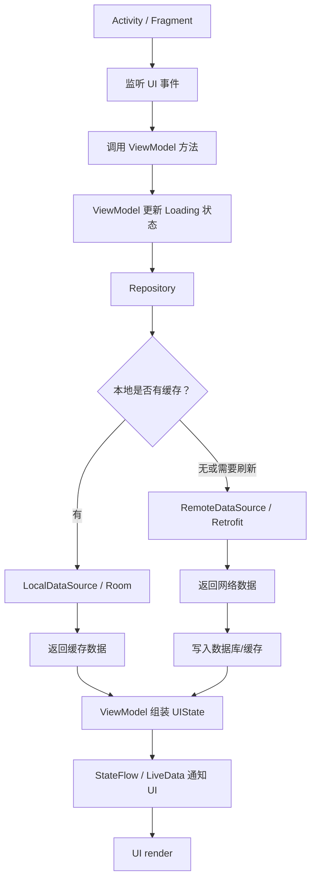

**为什么推荐 ViewModel + Repository**

如果 Activity 直接请求网络，会有几个问题：

- 横竖屏切换导致请求重复。
- 回调可能持有旧 Activity。
- UI 和数据逻辑耦合。
- 难以测试。

ViewModel 负责 UI 状态，Repository 负责数据来源，Activity/Fragment 只负责渲染。

**典型 UIState**

```kotlin
sealed interface UserUiState {
    object Loading : UserUiState
    data class Success(val user: User) : UserUiState
    data class Error(val message: String) : UserUiState
}
```

### 88. RecyclerView 刷新流程图

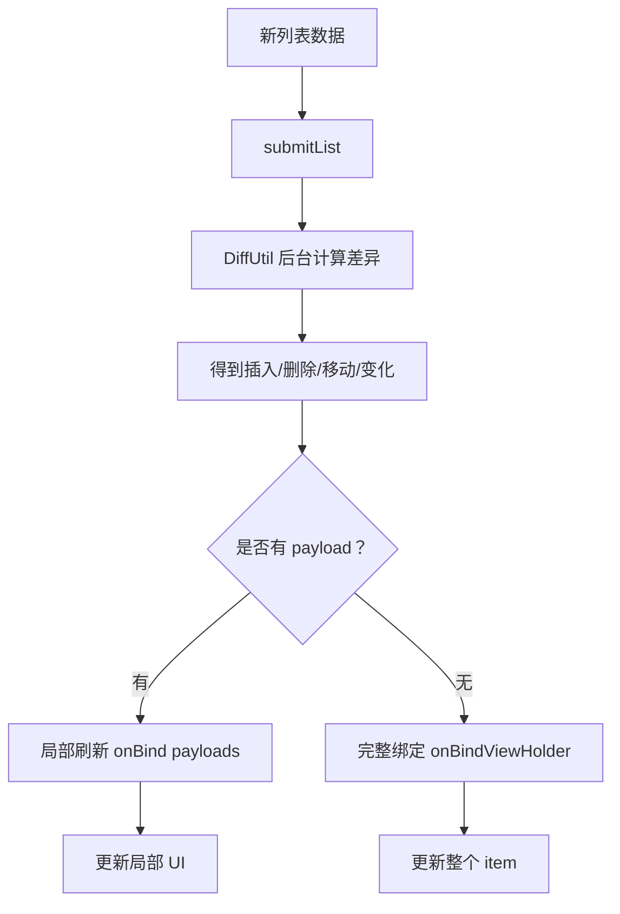

**为什么不推荐 `notifyDataSetChanged()`**

`notifyDataSetChanged()` 会告诉 RecyclerView：所有 item 都可能变了。它无法知道哪些 item 插入、删除、移动，也无法做精细动画和局部刷新。

更好的方式：

```kotlin
class UserDiff : DiffUtil.ItemCallback<User>() {
    override fun areItemsTheSame(oldItem: User, newItem: User): Boolean {
        return oldItem.id == newItem.id
    }

    override fun areContentsTheSame(oldItem: User, newItem: User): Boolean {
        return oldItem == newItem
    }
}
```

### 89. Room 数据库访问流程图

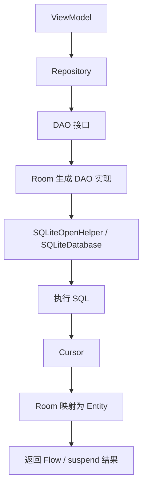

**数据库升级流程**

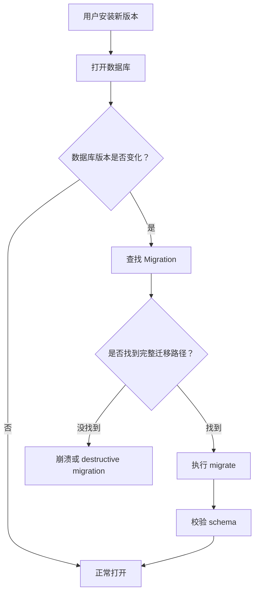

**常见坑**

- 新增非空字段必须给默认值。
- 删除字段、改字段类型要谨慎。
- 不要轻易使用 `fallbackToDestructiveMigration()`。
- SQL 查询不要在主线程执行。

### 90. WorkManager 执行流程图

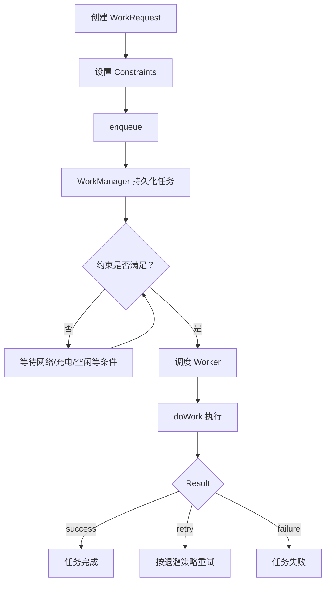

**适合 WorkManager 的任务**

- 日志上传。
- 聊天消息补偿同步。
- 图片压缩后上传。
- 本地数据定期同步。

**不适合 WorkManager 的任务**

- 用户点击后必须立刻完成的操作。
- 精确闹钟。
- 实时音视频。
- 音乐播放。

### 91. ANR 排查流程图

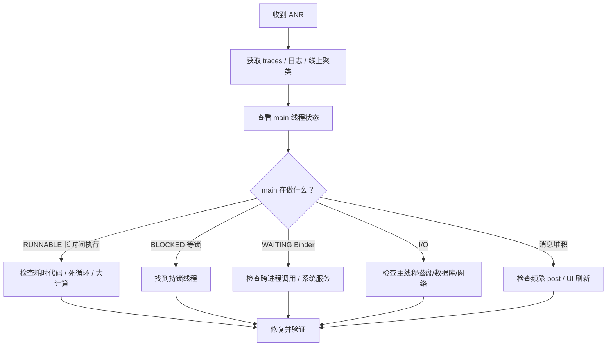

**ANR 分析不要只看 main 线程一行**

如果 main 线程是 `BLOCKED`，真正问题可能在持锁线程。如果 main 线程卡在 Binder，真正问题可能在对端进程或系统服务。

**面试表达**

```text
我会先看 ANR traces 的 main 线程。
如果 main 线程自己在执行耗时代码，就把耗时任务移出主线程。
如果 main 是 BLOCKED，就找持锁线程在做什么。
如果是 Binder 等待，就看对端服务是否超时。
所以 ANR 不只是主线程写了耗时代码，也可能是锁、Binder、I/O 或 CPU 饥饿。
```

### 92. 内存泄漏引用链流程图

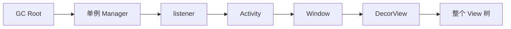

**典型错误**

```kotlin
object LocationManager {
    var listener: LocationListener? = null
}

class MapActivity : AppCompatActivity(), LocationListener {
    override fun onCreate(savedInstanceState: Bundle?) {
        super.onCreate(savedInstanceState)
        LocationManager.listener = this
    }
}
```

`LocationManager` 是进程级单例，持有 Activity 后，Activity 退出也无法回收。

**修复**

```kotlin
override fun onStart() {
    super.onStart()
    LocationManager.listener = this
}

override fun onStop() {
    LocationManager.listener = null
    super.onStop()
}
```

更好的方式是使用生命周期感知 API，避免手动管理监听器。

### 93. Android 面试回答模板

```mermaid
flowchart TD
    A["面试官问题"] --> B["先给定义"]
    B --> C["讲核心流程"]
    C --> D["补生命周期/线程/系统限制"]
    D --> E["说常见坑"]
    E --> F["给项目例子"]
    F --> G["说如何排查或验证"]
```

以“Service 是什么”为例：

```text
Service 是 Android 四大组件之一，用于执行没有界面的任务或对外暴露服务能力。
但 Service 默认运行在主线程，不是天然子线程。
启动式 Service 通过 startService/startForegroundService 启动，绑定式 Service 通过 bindService 交互。
Android 8 之后后台服务受限，用户可感知的长期任务要使用前台服务，可延迟任务更适合 WorkManager。
项目中如果做日志上传，我会优先用 WorkManager；如果做通话保活，会用前台服务并显示通知。
```

这个回答比“Service 是后台服务”更完整。
