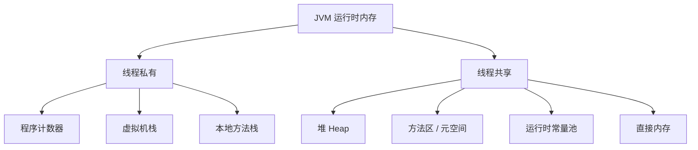
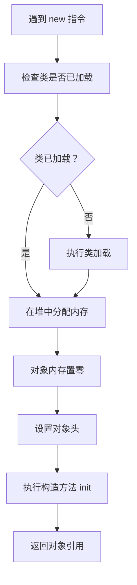
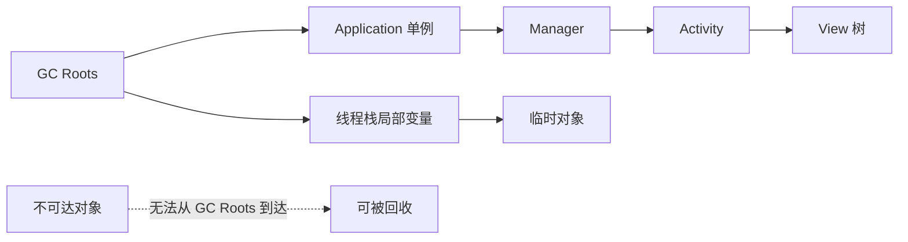
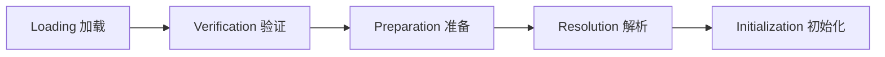
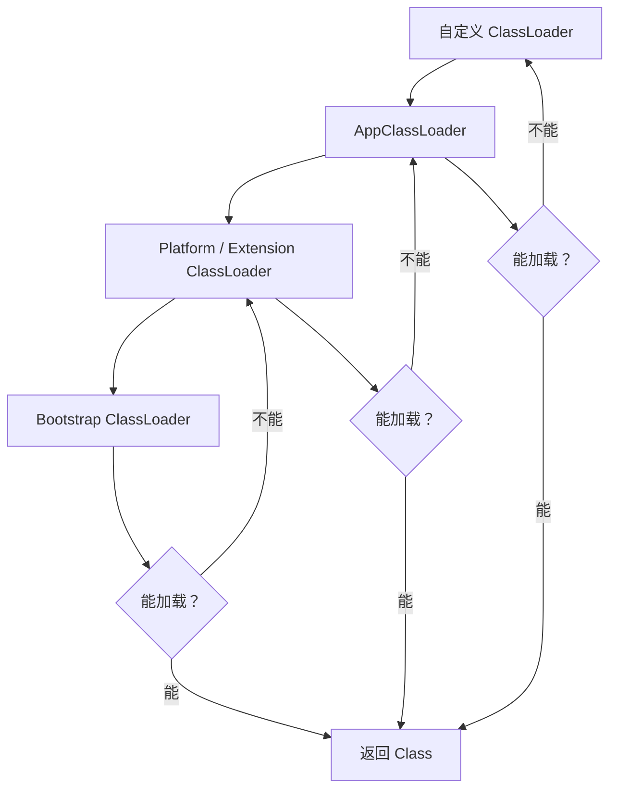
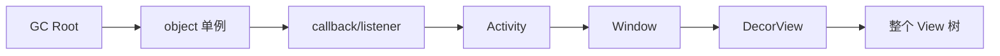
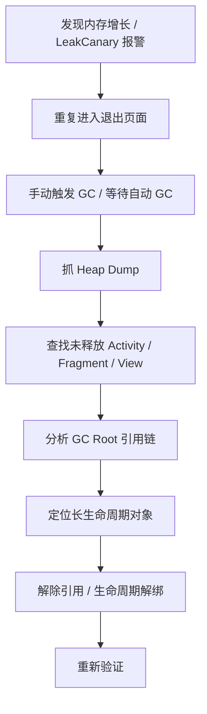
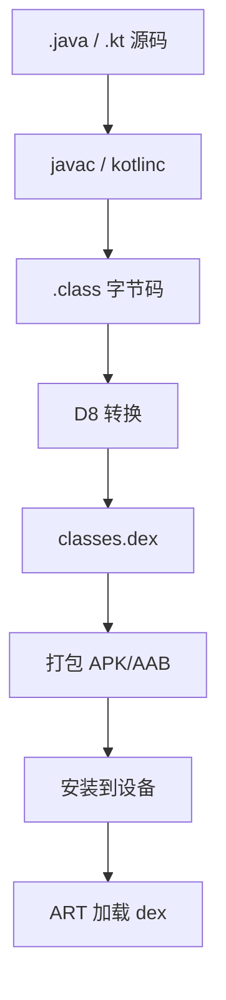

# JVM 相关面试题

> 面向 Android 面试场景，不追求后端 JVM 全覆盖。重点理解 Java/Kotlin 代码如何运行、对象如何分配和回收、为什么会 OOM/内存泄漏、JVM 和 Android ART 有什么区别。

## 一、先建立整体认知

### 1. JVM 是什么？

JVM 是 Java Virtual Machine，Java 虚拟机。它负责加载字节码、解释或编译执行字节码、管理内存、进行垃圾回收，并屏蔽底层操作系统差异。

普通 Java 程序大致流程：

```text
Java/Kotlin 源码
 -> 编译成 .class 字节码
 -> JVM 加载 class
 -> 解释执行 / JIT 编译
 -> 程序运行
```

Android 上不是直接运行标准 JVM，而是运行 Android Runtime，也就是 ART。Android 构建流程大致是：

```text
Java/Kotlin 源码
 -> .class
 -> D8/R8 转成 .dex
 -> ART 加载 dex
 -> 解释执行 / JIT / AOT / Profile Guided Compilation
```

所以 Android 面试里问 JVM，通常不是让你背 HotSpot 所有细节，而是看你是否理解运行时内存、GC、引用、类加载、OOM 和 ART 的关系。

### 2. JVM 和 ART 有什么区别？

| 对比项 | JVM / HotSpot | Android ART |
| --- | --- | --- |
| 字节码格式 | `.class` / `.jar` | `.dex` |
| 运行环境 | 桌面、服务端常见 | Android 设备 |
| 优化方式 | 解释执行 + JIT 为主 | 解释执行 + JIT + AOT + Profile |
| 内存限制 | 通常更宽松 | 移动设备内存更敏感 |
| GC 目标 | 吞吐、低延迟等 | 尽量减少 UI 卡顿和内存占用 |
| 包体影响 | 相对不敏感 | dex 数量、包体积、启动都很敏感 |

Android 早期使用 Dalvik，后来切到 ART。Dalvik 偏解释执行和 JIT；ART 引入更多 AOT 能力，安装或后台优化时可把热点代码提前编译，减少运行时开销。

### 3. Android 开发为什么还要懂 JVM？

因为很多 Android 问题本质仍然和 JVM/运行时基础有关：

- 对象分配过多导致频繁 GC，页面卡顿。
- Activity 被单例持有导致内存泄漏。
- 大 Bitmap 导致 OOM。
- Handler 延迟消息导致对象无法释放。
- 类加载、反射、动态代理影响启动速度。
- 线程过多导致栈内存、调度和 ANR 问题。
- Kotlin lambda、协程、匿名内部类可能捕获外部对象。
- R8 混淆、反射和泛型擦除相关问题。

面试时能把 Android 问题和运行时机制联系起来，会比只说“注意内存泄漏”更有说服力。

## 二、运行时内存区域

### 4. JVM 运行时内存区域有哪些？

经典 JVM 内存区域可以分为：

- 程序计数器。
- Java 虚拟机栈。
- 本地方法栈。
- Java 堆。
- 方法区。
- 运行时常量池。
- 直接内存。

简化理解：



Android 面试中最常被问的是堆、栈、方法区，以及对象为什么无法回收。

### 5. 堆和栈有什么区别？

| 对比项 | 堆 Heap | 栈 Stack |
| --- | --- | --- |
| 存什么 | 对象实例、数组 | 方法调用栈帧、局部变量、操作数栈 |
| 生命周期 | 由 GC 管理 | 方法调用结束自动出栈 |
| 线程关系 | 多线程共享 | 每个线程私有 |
| 常见问题 | OOM、内存泄漏、GC 频繁 | StackOverflowError、线程过多 |

示例：

```kotlin
fun test() {
    val user = User("Tom")
}
```

可以粗略理解为：

- `user` 这个局部变量引用在栈帧里。
- `User("Tom")` 对象在堆里。
- 方法结束后，栈帧销毁，`user` 引用消失。
- 如果没有其他引用指向 `User` 对象，它就可以被 GC 回收。

### 6. 栈帧里有什么？

每次方法调用都会创建一个栈帧，方法执行完栈帧出栈。

栈帧主要包括：

- 局部变量表。
- 操作数栈。
- 动态链接。
- 方法返回地址。

例如：

```kotlin
fun add(a: Int, b: Int): Int {
    val c = a + b
    return c
}
```

`a`、`b`、`c` 这些局部变量会在当前方法的栈帧中。方法返回后，这个栈帧就销毁。

### 7. 为什么递归太深会 StackOverflowError？

每次递归调用都会创建新的栈帧。如果递归太深，线程栈空间被耗尽，就会抛出 `StackOverflowError`。

错误示例：

```kotlin
fun loop() {
    loop()
}
```

Android 中虽然不常写深递归，但复杂树结构遍历、View 层级递归、自定义解析器都有可能出现类似问题。

### 8. 方法区 / 元空间存什么？

方法区存放类相关信息，例如：

- 类名。
- 字段信息。
- 方法信息。
- 常量。
- 静态变量。
- JIT 编译后的代码缓存等。

HotSpot JDK 8 以后用元空间 Metaspace 替代永久代 PermGen，元空间使用本地内存。

Android ART 的实现细节不同，但从面试理解上，可以把它看成“类元数据和运行时结构存放区域”。

## 三、对象创建与内存分配

### 9. 一个对象是怎么创建出来的？

典型流程：



对象创建不只是分配内存，还包括类加载检查、对象头设置、字段默认值初始化、构造方法执行。

### 10. 对象在内存中大概由什么组成？

对象通常由三部分组成：

- 对象头：存储运行时信息，如 hash、锁状态、GC 年龄、类型指针等。
- 实例数据：对象字段。
- 对齐填充：为了内存对齐。

数组对象还会额外保存数组长度。

Android 面试不用过度展开对象头位结构，但要知道“一个空对象也不是 0 字节”，大量小对象也会造成内存压力。

### 11. 什么是逃逸分析？

逃逸分析是 JIT 编译器的一种优化。它会分析对象是否逃出当前方法或线程。

如果对象没有逃逸，可能做这些优化：

- 栈上分配。
- 标量替换。
- 锁消除。

示例：

```kotlin
fun sum(): Int {
    val point = Point(1, 2)
    return point.x + point.y
}
```

如果 `point` 没有逃出方法，理论上运行时可能不真的在堆上创建完整对象，而是直接把 `x`、`y` 当作标量处理。

Android 中不要把逃逸分析当成日常优化手段，但它能解释为什么“源码里 new 了对象”不一定等于运行时真的分配了完整对象。

### 12. Android 中为什么要减少高频对象分配？

因为高频对象分配会带来：

- 堆增长。
- GC 频繁。
- GC 暂停线程。
- UI 掉帧。

典型错误：

```kotlin
override fun onDraw(canvas: Canvas) {
    val paint = Paint()
    val rect = Rect()
    canvas.drawRect(rect, paint)
}
```

`onDraw()` 可能一秒执行几十次，这样会频繁创建对象。

更好：

```kotlin
private val paint = Paint()
private val rect = Rect()

override fun onDraw(canvas: Canvas) {
    canvas.drawRect(rect, paint)
}
```

## 四、GC 与对象回收

### 13. GC 是什么？

GC 是 Garbage Collection，垃圾回收。它负责自动回收不再被引用的对象内存。

GC 要解决两个问题：

1. 哪些对象还活着？
2. 如何回收不再使用的对象？

判断对象是否存活，主流使用可达性分析。

### 14. 什么是可达性分析？

可达性分析从 GC Roots 开始，沿着引用链向下搜索。能从 GC Roots 到达的对象就是存活对象；不可达对象可以被回收。



常见 GC Roots：

- 当前线程栈中的局部变量。
- 静态变量引用的对象。
- JNI 引用。
- 系统类加载器引用的对象。
- 活跃线程对象。

### 15. 引用计数法为什么不够？

引用计数法是给对象维护一个引用计数，计数为 0 就回收。

问题是无法解决循环引用。

```kotlin
class Node {
    var next: Node? = null
}

val a = Node()
val b = Node()
a.next = b
b.next = a
```

如果外部不再引用 `a` 和 `b`，它们互相引用，引用计数都不为 0，但实际上已经不可达。

可达性分析可以解决这个问题，因为只要 GC Roots 到不了它们，就可以回收。

### 16. 常见 GC 算法有哪些？

常见算法：

- 标记-清除：标记存活对象，清除未标记对象。缺点是会产生内存碎片。
- 标记-整理：标记后把存活对象向一端移动，减少碎片。
- 复制算法：把内存分成两块，只使用其中一块，存活对象复制到另一块。适合新生代。
- 分代收集：根据对象生命周期不同，采用不同算法。

传统 HotSpot 常讲新生代、老年代。Android ART 的 GC 实现和 HotSpot 不完全一样，但“短命对象多、长寿对象少”这个思想仍然有价值。

### 17. Android 中 GC 为什么会造成卡顿？

GC 可能需要暂停应用线程，也就是 Stop-The-World。暂停时间过长或太频繁，就会影响主线程绘制。

60Hz 下，一帧只有约 16.67ms。如果滑动过程中频繁 GC，每次暂停几毫秒甚至十几毫秒，就可能掉帧。

典型场景：

- RecyclerView `onBindViewHolder()` 中频繁创建临时对象。
- 自定义 View `onDraw()` 创建对象。
- 大量字符串拼接。
- JSON 解析生成大量短命对象。
- 动画回调里频繁分配对象。

优化方向：

- 把对象创建移出高频路径。
- 使用对象复用。
- 减少临时集合和中间对象。
- 列表局部刷新，避免全量绑定。

### 18. `System.gc()` 能立即回收内存吗？

不能保证。`System.gc()` 只是建议虚拟机执行 GC，虚拟机可以选择忽略或延迟。

Android 开发中不建议依赖 `System.gc()` 解决内存问题。真正要做的是：

- 解除无用引用。
- 减小对象峰值。
- 控制缓存。
- 修复泄漏。
- 避免大对象同时存在。

## 五、引用类型

### 19. Java 有哪些引用类型？

Java 引用类型包括：

- 强引用。
- 软引用。
- 弱引用。
- 虚引用。

| 引用类型 | 回收时机 | Android 常见用途 |
| --- | --- | --- |
| 强引用 | 只要可达就不回收 | 普通对象引用 |
| 软引用 | 内存不足时可能回收 | 早期图片缓存，现在不推荐依赖 |
| 弱引用 | 下次 GC 可回收 | 避免回调持有 Activity |
| 虚引用 | 无法直接取对象，用于回收通知 | 底层资源管理 |

### 20. 强引用是什么？

普通赋值就是强引用：

```kotlin
val activity = this
```

只要强引用链能从 GC Roots 到达对象，对象就不会被回收。

Android 中内存泄漏大多数来自错误的强引用链，例如：

```text
GC Root -> 单例 -> listener -> Activity
```

### 21. 弱引用能解决所有内存泄漏吗？

不能。弱引用只是降低持有对象的强度，不是万能药。

示例：

```kotlin
class MyCallback(activity: Activity) {
    private val activityRef = WeakReference(activity)

    fun onResult() {
        val activity = activityRef.get() ?: return
        activity.finish()
    }
}
```

弱引用适合回调、缓存等场景。但更好的设计通常是明确生命周期，例如在 `onStop()` 注销监听，或使用 `repeatOnLifecycle`。

### 22. 软引用为什么不适合做 Android 图片缓存？

早期 Android 图片缓存有人用 SoftReference，但现在不推荐。原因：

- 回收时机不可控。
- 容易被系统清掉，缓存命中率不稳定。
- 图片缓存需要明确大小控制和 LRU 策略。

更好的方式是使用 LruCache 或成熟图片库，如 Glide、Coil、Fresco。

## 六、类加载机制

### 23. 类加载过程是什么？

类加载大致包括：

```text
加载 -> 验证 -> 准备 -> 解析 -> 初始化
```



解释：

- 加载：读取 class 或 dex 中的类信息。
- 验证：确保字节码安全、格式正确。
- 准备：为静态变量分配内存并设置默认值。
- 解析：把符号引用转换为直接引用。
- 初始化：执行静态变量赋值和静态代码块。

### 24. 类什么时候会初始化？

常见触发类初始化的场景：

- 创建类实例。
- 访问类的静态变量。
- 调用类的静态方法。
- 反射调用类。
- 初始化子类时，父类先初始化。

示例：

```kotlin
object UserManager {
    init {
        println("init")
    }
}
```

第一次访问 `UserManager` 时会触发初始化。

### 25. 静态变量初始化顺序是什么？

同一个类中，静态变量和静态代码块按源码顺序执行。

Java 示例：

```java
class Test {
    static int a = 1;

    static {
        a = 2;
    }

    static int b = a;
}
```

结果 `b = 2`。

如果初始化顺序复杂，容易出现值和预期不一致。Android 中单例、伴生对象、静态初始化 SDK 都要注意这一点。

### 26. 双亲委派模型是什么？

双亲委派是类加载器加载类时，先把请求交给父加载器，父加载器无法加载时，子加载器才尝试加载。



目的：

- 避免核心类被篡改。
- 保证类唯一性。

Android 上类加载器实现与标准 JVM 有区别，常见有 `PathClassLoader`、`DexClassLoader`，但“父加载器优先”的思想仍然重要。

### 27. Android 中 PathClassLoader 和 DexClassLoader 有什么区别？

| 类加载器 | 用途 |
| --- | --- |
| PathClassLoader | 加载已安装 APK 中的 dex |
| DexClassLoader | 加载外部 dex/jar/apk，常见于插件化、热修复 |

普通 App 运行主要使用 PathClassLoader。插件化和热修复会涉及 DexClassLoader 或自定义类加载逻辑。

Android 8.0 之后，动态加载外部代码受到更多安全和兼容限制。

### 28. 类加载为什么会影响启动性能？

启动阶段如果大量类首次加载，会产生开销：

- 读取 dex。
- 验证类。
- 初始化静态变量。
- 执行静态代码块。
- 反射查找方法字段。

典型问题：

```kotlin
object BigSdk {
    val config = loadConfigFromDisk()
    val cache = HashMap<String, Any>()
}
```

如果启动期首次访问 `BigSdk`，可能触发磁盘读取和大量初始化。

优化：

- 避免静态初始化做重活。
- SDK 延迟初始化。
- 减少启动期反射。
- 使用 Baseline Profile 优化关键路径。

## 七、OOM 与内存泄漏

### 29. OOM 是什么？

OOM 是 OutOfMemoryError，表示运行时无法分配所需内存。

Android 中常见 OOM 类型：

- Java heap OOM。
- Native heap OOM。
- Bitmap/GPU 相关内存压力。
- 线程过多导致栈内存不足。
- Binder transaction 过大。

不要把 OOM 简单等同于内存泄漏。OOM 可能是泄漏，也可能是瞬时峰值过高。

### 30. 内存泄漏是什么？

对象不再需要，但仍然被 GC Roots 间接引用，导致无法回收，就是内存泄漏。

典型 Android 引用链：



这种泄漏的危害不是只泄漏一个 Activity，而是 Activity 后面连着 Window、DecorView、所有 View、Drawable、Adapter、Bitmap 等对象。

### 31. Handler 为什么会导致 Activity 泄漏？

错误示例：

```kotlin
class MainActivity : AppCompatActivity() {
    private val handler = Handler(Looper.getMainLooper())

    override fun onCreate(savedInstanceState: Bundle?) {
        super.onCreate(savedInstanceState)
        handler.postDelayed({
            title = "done"
        }, 60_000)
    }
}
```

lambda 捕获了 `this`，MessageQueue 持有这个 Runnable。Activity finish 后，只要消息还没执行，Activity 就不能被回收。

引用链：

```text
Main Looper -> MessageQueue -> Message -> Runnable -> Activity
```

修复：

```kotlin
override fun onDestroy() {
    handler.removeCallbacksAndMessages(null)
    super.onDestroy()
}
```

或者使用生命周期感知协程。

### 32. Kotlin 协程会导致内存泄漏吗？

会，如果使用了错误的作用域。

错误示例：

```kotlin
GlobalScope.launch {
    delay(60_000)
    activity.runOnUiThread {
        activity.title = "done"
    }
}
```

`GlobalScope` 生命周期是全局的，任务可能比 Activity 活得更久。

推荐：

```kotlin
lifecycleScope.launch {
    delay(60_000)
    title = "done"
}
```

或把业务请求放到：

```kotlin
viewModelScope.launch {
    repository.loadData()
}
```

### 33. Bitmap OOM 怎么从 JVM 角度理解？

Bitmap 文件大小和内存大小不是一回事。解码后按像素占内存：

```text
width * height * bytesPerPixel
```

例如：

```text
4000 * 3000 * 4 = 48,000,000 bytes，约 45.8MB
```

多张大图同时存在，很容易造成 Java heap 或 native/graphics 内存压力。

优化：

- 按显示尺寸解码。
- 使用图片库 resize。
- 列表加载缩略图。
- 控制并发加载数量。
- 页面退出取消请求。
- 控制内存缓存大小。

### 34. 如何排查 Android 内存泄漏？

常用流程：



常用工具：

- LeakCanary。
- Android Studio Memory Profiler。
- heap dump。
- Perfetto / heapprofd，适合 native 内存。

## 八、线程与并发基础

### 35. Java 线程和 Android 主线程有什么关系？

Android 主线程本质也是 Java 线程，只是它创建了主 Looper，负责处理 UI、输入、生命周期等消息。

如果主线程被阻塞：

- UI 无法刷新。
- 点击无响应。
- 生命周期消息无法处理。
- 可能 ANR。

### 36. `synchronized` 锁的是什么？

`synchronized` 锁的是对象监视器 monitor。

实例方法：

```kotlin
@Synchronized
fun update() {}
```

锁的是当前实例 `this`。

静态方法：

```java
static synchronized void update() {}
```

锁的是 Class 对象。

代码块：

```kotlin
synchronized(lock) {
    // critical section
}
```

锁的是 `lock` 这个对象。

### 37. 主线程等待锁为什么会 ANR？

示例：

```kotlin
object UserCache {
    private val lock = Any()
    private var user: User? = null

    fun getUser(): User? = synchronized(lock) {
        user
    }

    fun refresh() = synchronized(lock) {
        user = api.fetchUser()
    }
}
```

如果后台线程进入 `refresh()` 后持有锁并执行网络请求，主线程调用 `getUser()` 会阻塞等待锁。ANR traces 里 main 线程可能显示为 `BLOCKED`。

修复原则：

- 不在锁内做网络、数据库、文件 I/O。
- 缩小锁范围。
- 主线程不等待锁。
- 使用不可变状态、原子变量或协程 Mutex 时也要注意调度线程。

### 38. volatile 有什么作用？

`volatile` 主要保证：

- 可见性：一个线程修改后，其他线程能看到最新值。
- 禁止部分指令重排序。

它不保证复合操作的原子性。

错误理解：

```kotlin
@Volatile var count = 0
count++
```

`count++` 包含读、加、写三个步骤，不是原子操作。多线程下仍可能丢失更新。

需要原子操作可以用：

```kotlin
val count = AtomicInteger(0)
count.incrementAndGet()
```

### 39. 死锁产生的条件是什么？

死锁通常需要四个条件：

- 互斥。
- 持有并等待。
- 不可抢占。
- 循环等待。

示例：

```kotlin
val lockA = Any()
val lockB = Any()

thread {
    synchronized(lockA) {
        synchronized(lockB) {}
    }
}

thread {
    synchronized(lockB) {
        synchronized(lockA) {}
    }
}
```

避免方式：

- 固定加锁顺序。
- 减小锁粒度。
- 避免锁内 I/O。
- 使用超时锁。

## 九、反射、泛型、注解

### 40. 反射是什么？为什么慢？

反射是在运行时获取类、方法、字段并调用的机制。

示例：

```kotlin
val clazz = Class.forName("com.example.User")
val method = clazz.getDeclaredMethod("getName")
val name = method.invoke(user)
```

反射慢的原因：

- 运行时查找类和方法。
- 访问检查。
- 无法像普通调用一样充分内联优化。
- 可能影响类加载。

Android 启动阶段大量反射会增加启动耗时。R8 混淆时，反射相关类和字段也需要 keep。

### 41. 泛型擦除是什么？

Java 泛型主要在编译期生效，运行时很多泛型信息会被擦除。

例如：

```kotlin
val list: List<String> = listOf("a")
```

运行时 `List<String>` 和 `List<Int>` 的原始类型都是 `List`。

这就是为什么不能直接：

```kotlin
if (list is List<String>) {}
```

Kotlin 中 `inline + reified` 可以在某些场景保留类型信息：

```kotlin
inline fun <reified T> Gson.fromJson(json: String): T {
    return fromJson(json, T::class.java)
}
```

### 42. 注解的保留策略有哪些？

Java/Kotlin 注解常见保留策略：

- SOURCE：只在源码中存在，编译后丢弃。
- CLASS：编译到 class 中，运行时不一定可见。
- RUNTIME：运行时可通过反射读取。

Android 常见：

- `@Keep`：配合混淆，避免类或成员被删除/改名。
- `@IntDef`：编译期约束 int 枚举。
- Retrofit 注解：运行时或构建时解析接口信息。
- Room 注解：编译期生成代码。

运行时注解通常有反射成本；编译期注解处理可以把成本提前到编译阶段。

## 十、JVM 与 Android 构建链路

### 43. Java/Kotlin 到 dex 的流程是什么？



release 构建中还可能经过 R8：

```text
.class -> R8 压缩/优化/混淆 -> D8/dex -> APK/AAB
```

### 44. R8 对运行时有什么影响？

R8 会：

- 删除未使用类和方法。
- 内联方法。
- 合并类。
- 优化控制流。
- 混淆名称。

好处：

- 包体更小。
- dex 更少。
- 部分运行时调用更快。

风险：

- 反射类被混淆导致找不到。
- Gson 字段名被改导致解析失败。
- JNI 方法名或类名被改导致 native 找不到。
- 第三方 SDK 入口被删除。

所以需要合理 keep，而不是一把梭保留整个包。

### 45. MultiDex 是什么？

DEX 中方法引用数量曾经有 65536 限制。方法数过多时，需要拆成多个 dex，这就是 MultiDex。

现代 Android 构建工具已经更好地处理 MultiDex，但它仍可能影响：

- 冷启动。
- dex 加载。
- 包体。
- 低版本兼容。

优化方向：

- 删除无用依赖。
- R8 压缩。
- 避免引入过重 SDK。
- 使用 App Bundle 和动态特性。

### 46. Baseline Profile 和 JVM 有什么关系？

Baseline Profile 是 Android ART 的性能优化机制，不是标准 JVM 知识，但和运行时编译有关。

它告诉 ART 哪些代码路径是热点，安装后可以提前编译这些代码，从而减少解释执行和 JIT 成本。

适合优化：

- 冷启动。
- 首次页面打开。
- RecyclerView 滚动。
- Compose 首次渲染。

可以理解为 Android 运行时层面对“热点代码”的提前优化。

## 十一、Android 面试常见 JVM 问法

### 47. 问：JVM 内存模型和 Android 内存优化有什么关系？

可以这样答：

```text
Android 虽然运行在 ART 上，不是标准 HotSpot JVM，但堆、栈、对象引用、GC Roots、可达性分析这些思想仍然适用。
比如 Activity 泄漏，本质是 Activity 通过某条强引用链仍然从 GC Roots 可达，所以 GC 不能回收。
列表滑动卡顿可能是高频分配对象导致频繁 GC。
Bitmap OOM 则是对象或 native/graphics 内存峰值过高。
所以理解 JVM 内存模型能帮助分析 Android 的泄漏、OOM 和卡顿。
```

### 48. 问：内存泄漏和 OOM 有什么区别？

```text
内存泄漏是对象不再需要但仍被引用，导致无法回收。
OOM 是内存分配失败。
泄漏可能最终导致 OOM，但 OOM 不一定是泄漏，也可能是瞬时加载了多张大图、一次查出大量数据、线程创建过多或 native 内存增长。
排查时要看内存是持续上涨不回落，还是某个操作瞬时峰值过高。
```

### 49. 问：GC 为什么会导致页面卡顿？

```text
GC 可能暂停应用线程，尤其主线程暂停会影响 UI 绘制。
一帧预算在 60Hz 下只有 16.67ms，如果滑动时 onBindViewHolder 或 onDraw 高频创建对象，会触发频繁 GC。
GC 暂停叠加布局绘制时间，就容易掉帧。
所以 Android 中要避免在高频路径创建临时对象。
```

### 50. 问：JVM 类加载和 Android 启动优化有什么关系？

```text
启动阶段首次访问类会触发类加载和可能的静态初始化。
如果类的 companion object、object 单例或 static block 中做了磁盘 I/O、反射、大对象创建，就会拖慢启动。
所以启动优化时要检查静态初始化和 SDK 自动初始化，把非必要工作延迟到首帧后或按需执行。
```

### 51. 问：强引用、软引用、弱引用在 Android 中怎么用？

```text
强引用是普通引用，只要从 GC Roots 可达就不会回收，大多数泄漏都是错误强引用导致。
弱引用适合避免回调持有 Activity，但不是万能解法，更好的方式是按生命周期注册和解绑。
软引用以前有人做图片缓存，但回收时机不可控，现在 Android 图片缓存更推荐 LruCache 或图片库。
```

## 十二、速记表

| 知识点 | Android 面试重点 |
| --- | --- |
| JVM | 标准 Java 运行时，Android 使用 ART |
| ART | 加载 dex，支持解释、JIT、AOT、Profile 优化 |
| 堆 | 对象和数组主要分配区域，GC 管理 |
| 栈 | 方法调用栈帧，线程私有 |
| GC Roots | 可达性分析起点 |
| 内存泄漏 | 无用对象仍从 GC Roots 可达 |
| OOM | 分配内存失败，不一定是泄漏 |
| 强引用 | 普通引用，最常导致泄漏 |
| 弱引用 | GC 时容易回收，可用于回调弱持有 |
| 软引用 | 回收时机不稳定，不推荐做 Android 图片缓存 |
| 类加载 | 加载、验证、准备、解析、初始化 |
| 静态初始化 | 启动期做重活会拖慢启动 |
| 反射 | 灵活但有性能和混淆风险 |
| 泛型擦除 | 运行时泛型信息大多被擦除 |
| synchronized | 锁对象 monitor，主线程等锁可能 ANR |
| volatile | 保证可见性，不保证复合操作原子性 |
| R8 | 压缩、优化、混淆，反射/JNI/Gson 要 keep |
| MultiDex | 方法数过多拆 dex，可能影响启动 |
| Baseline Profile | ART 热点代码预编译，优化启动和交互 |
